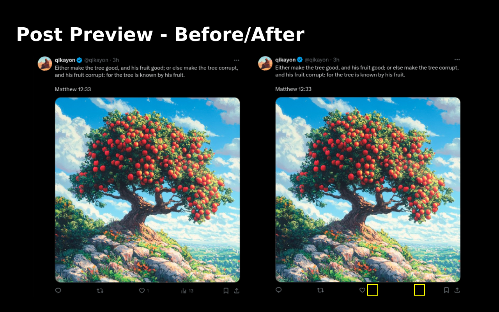

# Antisocial X

## Demo

[](https://www.youtube.com/watch?v=MVJ9KnPb7q4)

## About

The 🐑**antisocial_x** extension creates a truly neutral browsing experience on X (fka Twitter),
allowing users to engage with content based solely on its inherent value, without any influence
from visible engagement metrics, follower counts, or social proof indicators.

It preserves the ability for users to like and comment on posts, maintaining the core interactive
features of the platform while removing all potential influences of popularity metrics.

## Privacy
This extension operates entirely locally and does not collect or transmit any user data.

## What Gets Hidden

### Antisocial Mode:
- Like counts
- Retweet counts
- View counts
- Follower/Following counts
- Analytics
- "Followed by" indicators
- All other numerical social metrics

### Disable Notifications Mode:
- Notifications (optional)

## What Stays Functional
- Following/For You navigation
- Follow/Unfollow buttons
- Ability to like, retweet, and reply
- All content and media
- Core posting functionality

## Chrome Web Store

This addon is now available on the Chrome Web Store! [Get it here](https://chromewebstore.google.com/detail/antisocial-x/ealnpgcmoldhgjmficibhiajibejhlog)

## Manual Installation via Git

1. Get the Code:

```bash
git clone https://github.com/qi-kayon/antisocial_x.git
```

Or download and extract the ZIP file from this repository

2. Install in Chrome

- Navigate to chrome://extensions/
- Toggle on "Developer mode" in the top right
- Click "Load unpacked"
- Select the folder containing the extension

3. Test It Out

- Visit X/Twitter
- Social metrics should be hidden
- Core functionality should remain intact

## Troubleshooting

If metrics become visible again:

- Visit chrome://extensions/
- Find Antisocial X
- Click the refresh icon (🔄)
- Reload X/Twitter

## Contributing

Feel free to fork the repository, and create pull requests for any improvements.

## Screenshots

### Toggle Modes


### Profile Changes


### Post Changes




## Support
If you encounter any issues or have suggestions, please:
- Open an issue on GitHub: https://github.com/qi-kayon/antisocial_x/issues
- Or contact me directly: https://github.com/qi-kayon